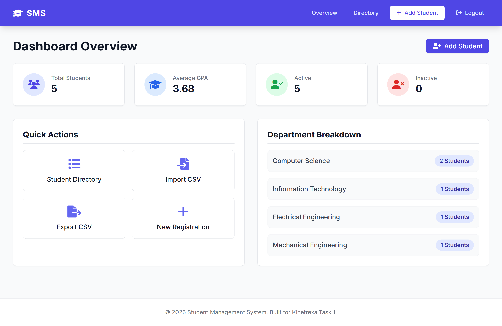
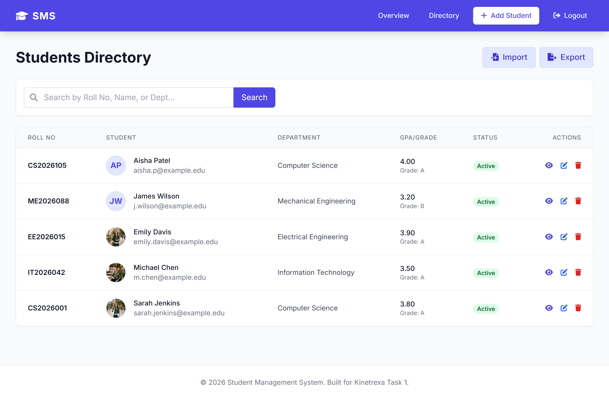

# Academia - Role-Based Student & Attendance Management System

> **Short Description (Max 250 characters for LinkedIn / GitHub):**
> *A full-featured Django & Tailwind CSS Student Management System featuring Role-Based Access Control (Admin, Teacher, Student), interactive daily attendance allocation, self-service student portals, analytics, and instant PDF ID card generation.*

---

## 🌟 Highlights & Key Capabilities

- 🔐 **Role-Based Access Control (RBAC):** Dedicated sessions and customized views for **Admin**, **Teacher (Faculty)**, and **Student** accounts with automated permission routing.
- 📅 **Faculty Attendance Allocation:** Interactive daily class roster marking (Bulk Present/Absent/Late/Excused), date selector, and custom session remarks.
- 🎓 **Student Self-Service Portal:** Personalized portal displaying cumulative GPA, academic standing, live attendance compliance gauge ($\ge 75\%$), and chronological session logs.
- 📊 **Real-Time Analytics & Audit Trail:** Interactive institution metrics, department distribution breakdowns, attendance audit logs, and status filtering.
- 🪪 **Vector PDF ID Card Generation:** Direct one-click download of styled, printable student identification badges with attendance stats.
- 📁 **Data Pipeline (CSV Import / Export):** Bulk upload students via CSV, export filtered student records and complete attendance sheets.
- 🎨 **Modern Responsive UI:** Built with Tailwind CSS, FontAwesome icons, glassmorphic badges, and mobile-ready layouts.

---

## 👥 Role Sessions & Permissions

| Role | Access Level | Key Capabilities |
| :--- | :--- | :--- |
| 🛡️ **Administrator** | Full System Access | Analytics overview, complete student CRUD, multi-role management, bulk CSV import/export, attendance audit log. |
| 👨‍🏫 **Teacher / Faculty** | Academic & Roster Access | Department-filtered dashboard, bulk class attendance marker, student directory lookup, attendance export. |
| 🎓 **Student** | Self-Service Portal | Personal profile overview, cumulative GPA & letter grade, live attendance meter ($\ge 75\%$ threshold), session activity history, PDF ID card download. |

---

## 🔑 Demo Login Credentials

For testing and demonstration, use any of the pre-configured role accounts:

| Role | Username | Password | Purpose |
| :--- | :--- | :--- | :--- |
| **Admin** | `admin` | `admin` | Full management dashboard & controls |
| **Teacher** | `teacher` | `teacher123` | Faculty attendance marking & department view |
| **Student** | `student` | `student123` | Personal student portal (Sarah Jenkins `CS2026001`) |

*(The login screen also includes 1-click credential prefill buttons for instant demo access!)*

---

## 📸 Project Showcase

### 1. Dynamic Analytics Dashboard
Provides administrators and teachers with high-level institutional metrics, average GPA, attendance rates, and department distributions.


### 2. Interactive Attendance Marking (Faculty)
Faculty can select a date and department to allocate attendance status (*Present, Late, Absent, Excused*) with instant 1-click batch selection and notes.

### 3. Student Self-Service Academic Portal
Students log into a customized portal tracking their cumulative GPA, academic standing, and attendance compliance gauge with detailed session activity logs.

### 4. Student Directory & Search
Search and filter students by Roll Number, Name, or Department with instant profile preview and direct action links.


### 5. Printable PDF ID Card Generation
Download automated vector PDF ID cards with student photograph, department details, and academic standing.

---

## 🛠️ Technology Stack

- **Backend:** Python 3.10+, Django 5.x
- **Frontend:** HTML5, Tailwind CSS, FontAwesome 6, Chart-ready layouts
- **Database:** SQLite (Relational ORM with foreign key cascades)
- **Data Export / Import:** Pandas, OpenPyXL, Python CSV
- **Document Engine:** ReportLab (Vector PDF Generation)
- **Image Processing:** Pillow

---

## ⚙️ Quickstart & Local Setup

### 1. Clone the repository
```bash
git clone https://github.com/ANAND-JATOTHU/kinetrexa-task-1.git
cd kinetrexa-task-1
```

### 2. Activate Virtual Environment
```bash
# Windows:
.\venv\Scripts\activate
# Mac / Linux:
source venv/bin/activate
```

### 3. Install Dependencies
```bash
pip install -r requirements.txt
```

### 4. Run Migrations
```bash
python manage.py migrate
```

### 5. Seed Multi-Role Demo Data
Populates the database with default Admin, Teacher, Student accounts, demo profiles, and 14 days of realistic attendance history:
```bash
python seed.py
```

### 6. Start Development Server
```bash
python manage.py runserver
```

Open your browser at `http://127.0.0.1:8000/` and sign in using `admin`/`admin`, `teacher`/`teacher123`, or `student`/`student123`.

---

## 🧪 Running Automated Tests

Run the full automated test suite verifying RBAC routing, attendance marking, student portals, and PDF generation:
```bash
python manage.py test
```

---

## 👨‍💻 Author
Built with ❤️ by **Anand Jatothu** for Kinetrexa Internship Task.
